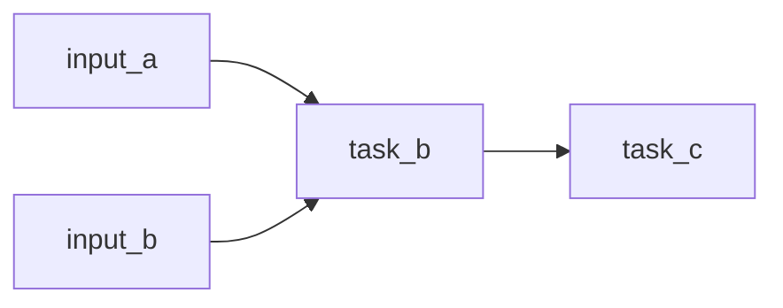

# Tiramisu

Turn a step-by-step plan into a functional dependency graph that can be delegated to subagents.

## Reference
- Functional framing source: [What’s Functional Programming All About?](https://www.lihaoyi.com/post/WhatsFunctionalProgrammingAllAbout.html)
- Canonical recipe example: Michael Chu's Classic Tiramisu (as described in the article)

## Canonical Example (Imperative Recipe)
Use this as a default example for parsing imperative plans:

Ingredients:
- `4 large egg yolks`
- `1/2 cup granulated sugar` (plus `2 tsp` for espresso)
- `1/2 cup sweet Marsala wine`
- `16 oz mascarpone cheese`
- `1 cup heavy cream`
- `about 40 ladyfingers`
- `12 oz prepared espresso`
- `2 tbsp cocoa powder`

Steps:
1. Dissolve `2 tsp sugar` into espresso and chill.
2. Whisk egg yolks.
3. Add sugar and Marsala wine; blend.
4. Whisk mixture over steam until thick/smooth.
5. Beat mascarpone until creamy.
6. Whip heavy cream to soft peaks.
7. Combine custard with mascarpone; beat smooth.
8. Fold in whipped cream.
9. Soak ladyfingers briefly in espresso.
10. Assemble layers: soaked ladyfingers, cream, soaked ladyfingers, cream.
11. Sift cocoa on top.
12. Refrigerate for `4 hours`.

Expected dependency shape:
- Custard branch: yolks + sugar + wine -> whisk over steam
- Cream branch: heavy cream -> whip
- Cheese branch: mascarpone -> beat
- Espresso branch: espresso + sugar -> soak ladyfingers
- Merge: custard + mascarpone + whipped cream -> cream filling
- Final: assemble + sift cocoa -> refrigerate

## Input
- A plan, checklist, or strategy text.
- Optional: available subagents/roles, deadlines, constraints.

## Workflow
1. Extract atomic tasks as functions: `output = action(inputs)`.
2. Name each intermediate artifact/output explicitly.
3. Build a DAG:
- Node fields: `id`, `function`, `inputs`, `output`, `depends_on`, `definition_of_done`, `agent_hint`.
- Edge rule: connect producer `output` to consumer `inputs`.
4. Topologically sort into parallel lanes & waves for delegation.
5. Create handoff packets per node with required inputs and acceptance checks.
6. Add reintegration requirements anywhere parallel branches could diverge on the same concept, API, naming, UX, or abstraction.
7. List missing dependencies, assumptions, and blockers.

## Output Format
Return sections in this exact order:

1. `Functional Graph (Lane Diagram)`
2. `Node Registry`
3. `Subagent Waves`
4. `Handoff Packets`
5. `Gaps & Assumptions`

### Functional Graph Template (Lane Diagram)
Draw the DAG as left-to-right lanes merging with box-drawing characters, one lane per line:

```text
12 oz espresso + 2 tsp sugar -> dissolve -> chill ──────────────────────────────────────────┐
~40 ladyfingers ────────────────────────────────────────────────────────────────────────────┴─ soak 1 sec each ─────────────┐
4 egg yolks -> whisk -> + 1/2 cup sugar & Marsala -> whisk over steam ────────┐                                             │
16 oz mascarpone -> beat until creamy ────────────────────────────────────────┴─ combine ───────┐                           │
1 cup heavy cream -> whip to soft peaks ────────────────────────────────────────────────────────┴─ fold ────────────────────┤
                                                                                                                            └─ assemble 2x layers -> sift cocoa -> refrigerate 4 hrs -> Tiramisu
```

Formatting rules:
- One lane per line, flowing left to right; use `->` for steps **within** a lane.
- Use box-drawing characters only for joins: `┐` turn down, `┘` turn up, `┴`/`┤`/`┼` side merge, `│` pass-through, `└` emit the merged step, `─` horizontal fill.
- Pad lanes with `─` so every join character in the same merge sits in the same column; verify the columns line up before returning.
- Order lanes so the diagram reads top-left to bottom-right: earliest-available inputs at the top, and the final merged step on its own junction row at the bottom (`└`), never in the middle of the lanes.
- Keep it in a fenced ` ```text ` block so the alignment survives rendering.
- For very large graphs, or when the harness renders it, a Mermaid `flowchart LR` is an acceptable fallback:



### Node Registry Template
| id | function | inputs | output | depends_on | agent |
| --- | --- | --- | --- | --- | --- |
| N1 | `brief = writeBrief(research)` | `research` | `brief` | `-` | `subagent-research` |

### Subagent Waves Template
- Wave 0: `N1`, `N2`
- Wave 1: `N3`
- Wave 2: `N4`

### Handoff Packet Template
- `N3`
- Objective: one sentence goal
- Inputs required: explicit artifacts
- Deliverable: output schema/path
- Acceptance checks: testable done criteria

## Heuristics
- Prefer real data dependencies over chronological ordering words.
- Split overloaded steps into smaller pure transformations.
- If a cycle appears, identify the missing artifact or boundary and break the cycle.
- Keep node outputs concrete so another agent can execute without extra clarification.
- Add explicit synthesis nodes when two branches may evolve the same concept differently.
- Plan merges semantically: the reintegration step should unify intent, concepts, naming, abstractions, and project behavior, not just produce conflict-free files.
- When the user needs that reintegration work executed, do a dedicated semantic merge pass.
